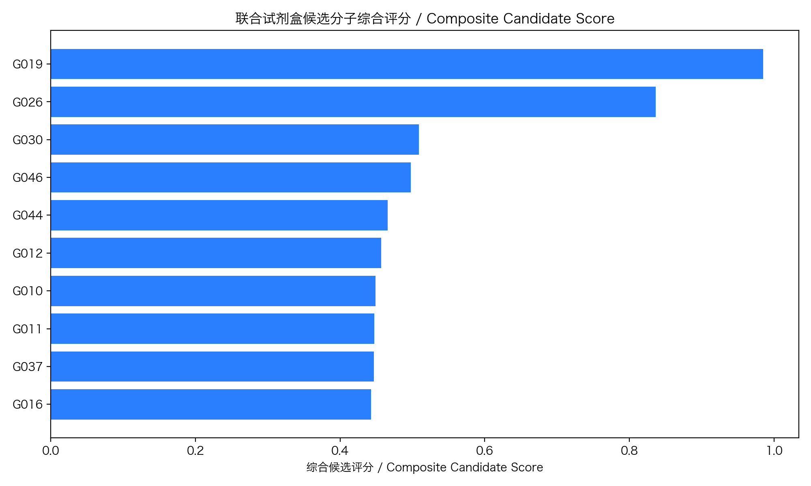
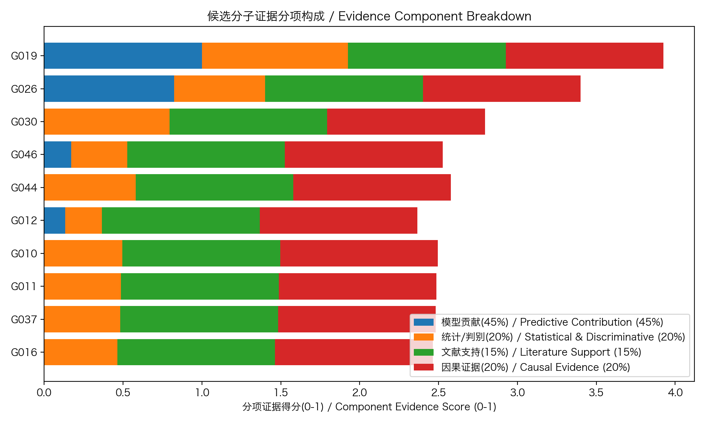
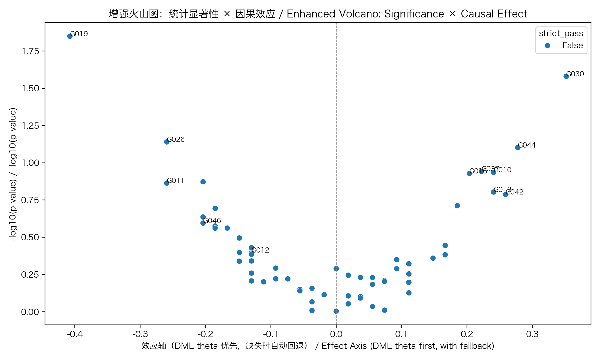
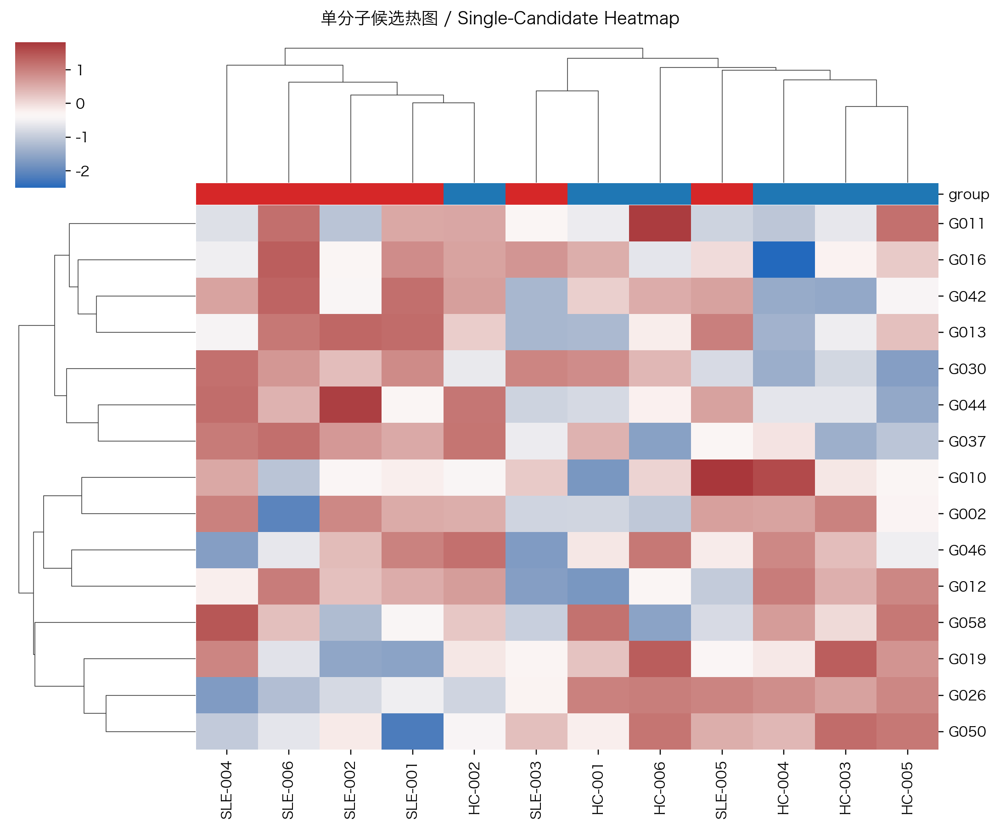
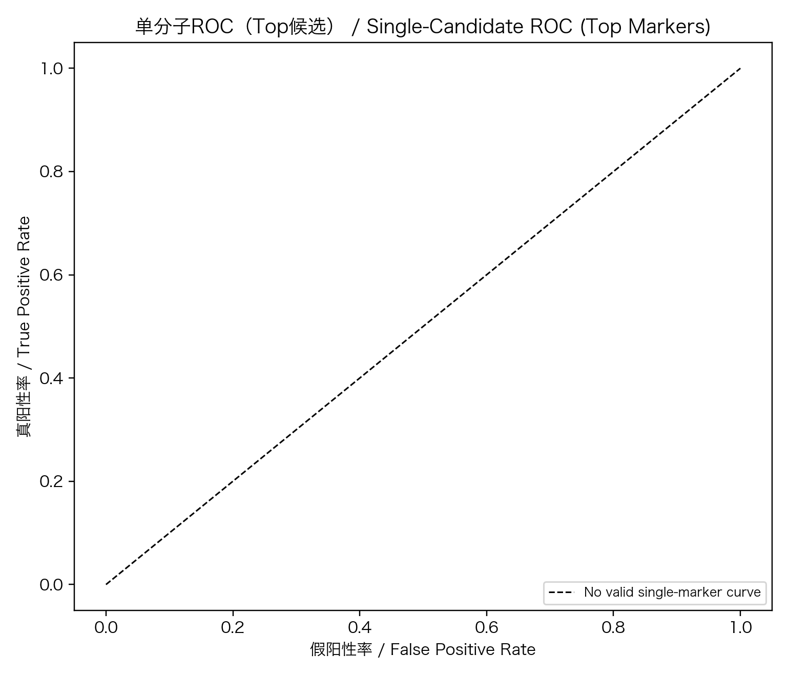
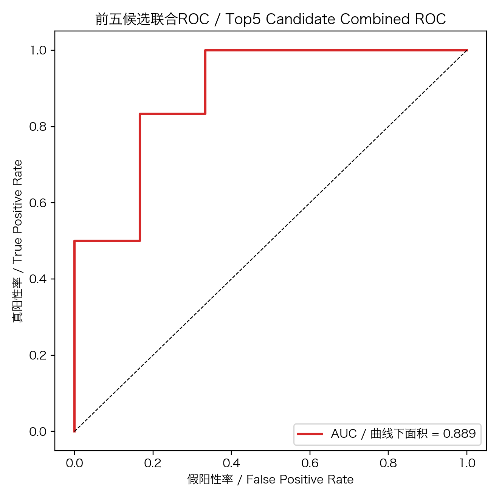
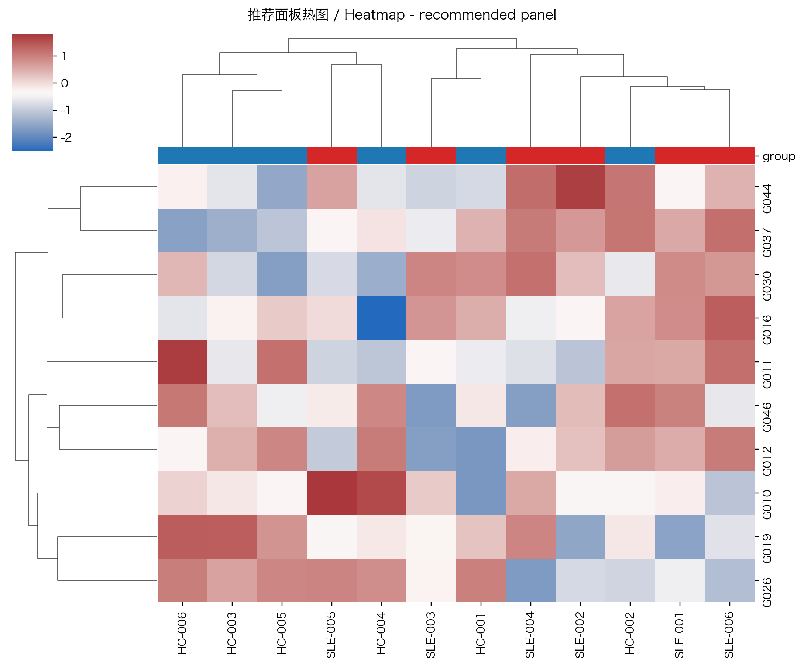
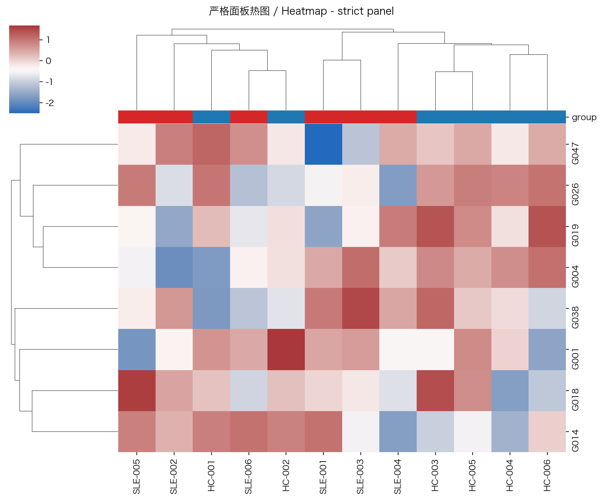
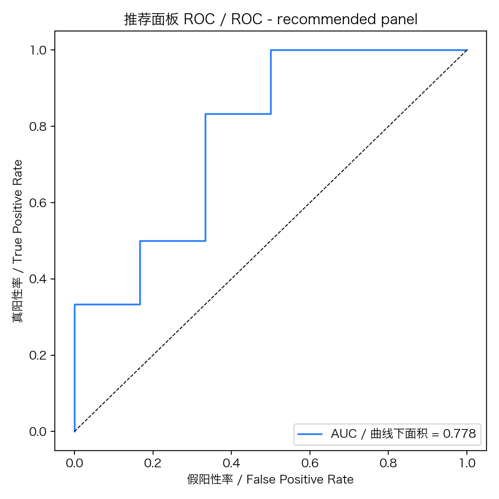
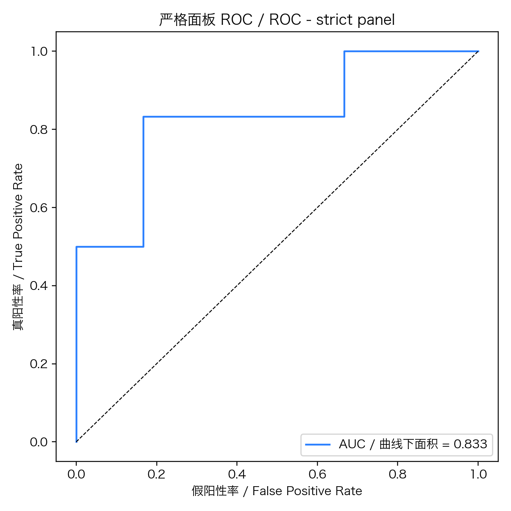

# 联合试剂盒候选 Biomarker 开发报告

## 评分策略（含最新因果推断，可解释）
- 模型贡献权重（45%）：来自 XGBoost SHAP 绝对值均值，表示分子对预测输出的平均贡献。
- 统计/判别证据（20%）：综合 FDR 显著性与 AUC 区分能力。
- 近三年文献支持（15%）：PubMed 中 SLE 主题下最近三年的文献命中数量。
- 因果证据（20%）：Double Machine Learning (PLR) 估计因果效应 + E-value 稳健性评估。

## 候选联合面板（推荐）

| 排名 | 分子 | 类型 | 综合评分 | SHAP贡献 | 统计/判别 | 文献 | 因果证据 |
|---:|---|---|---:|---:|---:|---:|---:|
| 1 | G019 | protein | 0.985 | 1.000 | 0.926 | 0 | 1.000 |
| 2 | G026 | protein | 0.836 | 0.824 | 0.577 | 0 | 1.000 |
| 3 | G030 | protein | 0.509 | 0.000 | 0.794 | 0 | 1.000 |
| 4 | G046 | protein | 0.498 | 0.171 | 0.355 | 0 | 1.000 |
| 5 | G044 | protein | 0.466 | 0.000 | 0.579 | 0 | 1.000 |
| 6 | G012 | protein | 0.457 | 0.134 | 0.232 | 0 | 1.000 |
| 7 | G010 | protein | 0.449 | 0.000 | 0.496 | 0 | 1.000 |
| 8 | G011 | protein | 0.447 | 0.000 | 0.487 | 0 | 1.000 |
| 9 | G037 | protein | 0.447 | 0.000 | 0.483 | 0 | 1.000 |
| 10 | G016 | protein | 0.443 | 0.000 | 0.464 | 0 | 1.000 |

## 每个候选分子的“为什么”
- **G019**（protein）: 模型贡献权重=1.00；统计/判别证据=0.93；近三年文献命中=0篇；因果证据=1.00；AUC=0.093；FDR=1.41e-02。
- **G026**（protein）: 模型贡献权重=0.82；统计/判别证据=0.58；近三年文献命中=0篇；因果证据=1.00；AUC=0.241；FDR=7.24e-02。
- **G030**（protein）: 模型贡献权重=0.00；统计/判别证据=0.79；近三年文献命中=0篇；因果证据=1.00；AUC=0.852；FDR=2.63e-02。
- **G046**（protein）: 模型贡献权重=0.17；统计/判别证据=0.36；近三年文献命中=0篇；因果证据=1.00；AUC=0.296；FDR=2.54e-01。
- **G044**（protein）: 模型贡献权重=0.00；统计/判别证据=0.58；近三年文献命中=0篇；因果证据=1.00；AUC=0.778；FDR=7.91e-02。
- **G012**（protein）: 模型贡献权重=0.13；统计/判别证据=0.23；近三年文献命中=0篇；因果证据=1.00；AUC=0.370；FDR=4.00e-01。
- **G010**（protein）: 模型贡献权重=0.00；统计/判别证据=0.50；近三年文献命中=0篇；因果证据=1.00；AUC=0.741；FDR=1.16e-01。
- **G011**（protein）: 模型贡献权重=0.00；统计/判别证据=0.49；近三年文献命中=0篇；因果证据=1.00；AUC=0.241；FDR=1.37e-01。
- **G037**（protein）: 模型贡献权重=0.00；统计/判别证据=0.48；近三年文献命中=0篇；因果证据=1.00；AUC=0.722；FDR=1.14e-01。
- **G016**（protein）: 模型贡献权重=0.00；统计/判别证据=0.46；近三年文献命中=0篇；因果证据=1.00；AUC=0.704；FDR=1.18e-01。

## 更严格临床转化候选清单（因果阈值过滤）
- 阈值：`|DML| >= 0.080` 且 `E-value >= 2.000`

| 排名 | 分子 | 类型 | 综合评分 | |DML| | E-value |
|---:|---|---|---:|---:|---:|
| 1 | G019 | protein | 0.985 | nan | nan |
| 2 | G026 | protein | 0.836 | nan | nan |
| 3 | G004 | protein | 0.384 | nan | nan |
| 4 | G001 | protein | 0.384 | nan | nan |
| 5 | G038 | protein | 0.383 | nan | nan |
| 6 | G018 | protein | 0.381 | nan | nan |
| 7 | G014 | protein | 0.380 | nan | nan |
| 8 | G047 | protein | 0.379 | nan | nan |

## 必要性能与可视化结果

| 面板 | 特征数 | CV AUC | CV F1 |
|---|---:|---:|---:|
| recommended | 10 | 0.778 | 0.769 |
| strict | 8 | 0.833 | 0.600 |
| top5_combined | 5 | 0.889 | 0.600 |

## 产出文件
- `outputs_candidate/panel_candidates.tsv`：推荐联合面板清单。
- `outputs_candidate/strict_translational_candidates.tsv`：严格临床转化清单（因果阈值过滤）。
- `outputs_candidate/all_candidates_scored.tsv`：全部候选分子评分明细。
- `outputs_causal/causal_marker_effects.tsv`：DML 因果效应、95%CI、调整 OR 与 E-value。
- `outputs_candidate/figs/panel_total_score.png`：综合评分图。
- `outputs_candidate/figs/panel_evidence_breakdown.png`：证据分项构成图。
- `outputs_candidate/figs/enhanced_volcano_causal.png`：增强火山图。
- `outputs_candidate/figs/heatmap_single_candidates.png`：单分子候选热图。
- `outputs_candidate/figs/roc_single_candidates_top5.png`：单分子 ROC（Top 候选）。
- `outputs_candidate/figs/roc_top5_combined_candidates.png`：前五候选联合 ROC。
- `outputs_candidate/figs/heatmap_recommended_panel.png` / `heatmap_strict_panel.png`：面板热图。
- `outputs_candidate/figs/roc_recommended_panel.png` / `roc_strict_panel.png`：ROC 曲线。
- `outputs_candidate/single_marker_metrics.tsv`：单分子 AUC/F1 指标汇总。
- `outputs_candidate/panel_model_metrics.tsv`：AUC/F1 指标汇总。

## 说明
- 本报告用于候选分子优先级排序，不替代外部队列和临床验证。
- 若为单组学输入，结果仅基于该组学候选自动生成。
